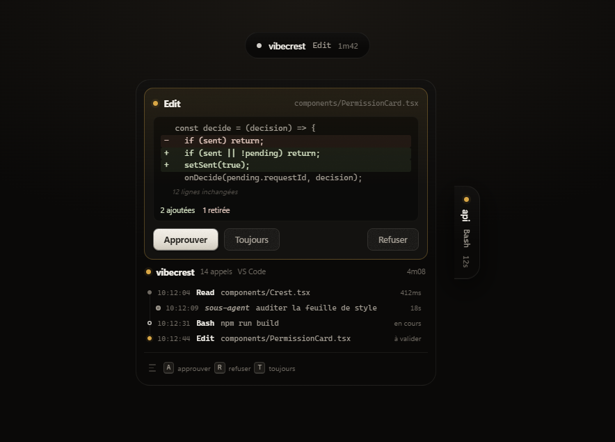

<div align="center">

# Vibe Crest

**Watch your Claude Code sessions from a panel docked to the edge of your screen.**

See what the agent is doing, approve its actions without switching windows,
jump back to the right terminal in one click. Codex reports its turn endings.

*A free and open Windows alternative to [Vibe Island](https://vibeisland.app).*

<br>

[](README.md)

<br>


<br>



</div>

<br>

## What it does

- **See before you approve.** A real diff for `Edit`, the content for `Write`,
  the plan rendered as Markdown for `ExitPlanMode`. Never again a bare file path
  to approve blindly.
- **Decide from the panel.** Approve, deny, or set a rule that holds for the rest
  of the session.
- **Answer the agent's questions**, multiple choice and free text included.
- **Follow activity live**, every tool call with its duration, subagents included.
- **Jump back to the exact terminal**, down to the right panel in VS Code thanks
  to a companion extension.
- **Track your usage**, computed offline from local transcripts.
- **Put the panel wherever you want**, on any edge or floating, on any display.
- **Codex CLI** is supported for its turn endings. No approvals, no tool log.

Everything stays on the machine: a local channel between the Claude Code hooks
and the app. No network traffic, no telemetry, no account.

## Install

Requires [Node.js](https://nodejs.org) 20 or newer.

```powershell
git clone https://github.com/xMazaki/vibecrest.git
cd vibecrest
npm install
npm start
```

The app starts in the notification area and walks you through it: hook
installation, settings, done. Then open a **new** Claude Code session, since
hooks are only read when a session starts.

To build a standalone installer:

```powershell
npm run dist
```

## How it works

Claude Code runs a short script on every event. That script writes to a local
named pipe, the app displays it, and for a gated tool the script **stays
suspended** until you decide, with the answer travelling back over the same
channel.

```text
Claude Code  →  agent-hook.cjs  →  \\.\pipe\vibe-crest  →  panel
                                                            ↓
Claude Code  ←──────── decision ────────────────────────────┘
```

If the app is not running, if an error occurs or if the timeout expires, the
script returns without writing anything and Claude Code falls back to its usual
behaviour. It cannot break a session.

## Shortcuts

| Key | Effect |
| --- | --- |
| `Alt+G` | summon the panel and give it the keyboard |
| `A` | approve |
| `R` | deny |
| `T` | stop asking for this tool |
| `Tab` | next request |
| `Esc` | collapse |

## Development

```powershell
npm run dev          # Vite hot reload plus Electron
npm test             # placement geometry
npm run preview      # rendering bench, writes preview.png
npm run hero         # repository illustration
```

The rendering bench draws the panel states from the compiled stylesheet. A
screenshot of the running app depends on session state and cursor position; the
bench is deterministic.

## Known limits

- **Codex** exposes a single event, the end of a turn. No approvals, no tool log.
- **Outside an editor**, jumping back activates the window without targeting the
  tab.
- **Memory footprint** in the range of 150 to 250 MB.

## License

MIT
